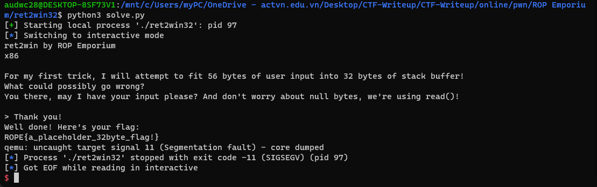

**1. Tìm lỗi**

Chạy thử file bằng IDA ta có như sau: 


Source hàm pwnme:


Ta thấy biến s được khai báo 32 byte nhưng cho nhập 0x38 = 56 byte -> Có lỗi bof


Ta thấy ở hàm này thì có thể lấy được nội dung của flag

Dùng lệnh 'checksec' để kiểm tra


Ta thấy CANARY đang ở trạng thái disabled -> có thể khai thác qua lỗi bof

**2. Ý tưởng**

Biến s cho nhập 0x38 = 56 phần tử nên thử nhập tràn biến s đến ret rồi chèn địa chỉ hàm ret2win vào

**3. Viết script**


Địa chỉ biến s hiện tại là: rbp - 0x20 -> Khoảng cách từ biến s đến ret là: 0x20 + 0x8 = 40


Địa chỉ hàm win là: 0x400756

Ta có script như sau:

```
from pwn import *

r = process("./ret2win32")

ret2win = 0x804862c
payload = b'a'*44 + p32(ret2win)
r.sendline(payload)
r.interactive()
```

**4. Lấy flag**



Flag: ROPE{a_placeholder_32byte_flag!}